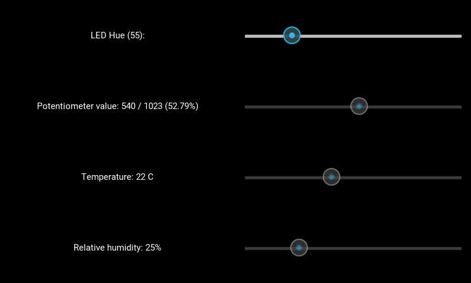

Introduction
============

This is a small demonstration of using Kivy on a single-board computer
to interact with an external microcontroller on a serial port connection.




Installation
============

Tested on
* Raspberry Pi 3 B running Rasbian Stretch (Python 3)
* Arduino Uno Rev 3 microcontroller

```
sudo apt-get install -y \
    python-pip \
    build-essential \
    git \
    python \
    python-dev \
    python-numpy \
    ffmpeg \
    libsdl2-dev \
    libsdl2-image-dev \
    libsdl2-mixer-dev \
    libsdl2-ttf-dev \
    libsmpeg-dev \
    libportmidi-dev \
    libswscale-dev \
    libavformat-dev \
    libavcodec-dev \
    zlib1g-dev
```

Next, set up and activate a virtual environment for this project:
```
virtualenv kivy_venv
./kivy_venv/bin/activate
```

Next, install Kivy (details https://kivy.org/doc/stable/installation/installation.html):
`pip install -r requirements`

Python modifications
====================

Edit the kivyhw.py to set the `USBPORT` line to be the device name of the
microcontroller's serial port (probably something like '/dev/ttyUSB0').

Microcontroller code
====================

Make any desired modifications and burn code to your microcontroller.

Running
=======

Finally, start up the Python application:
`python kivyhw.py`

The Kivy screen should open fullscreen and should connect to the microcontroller.
